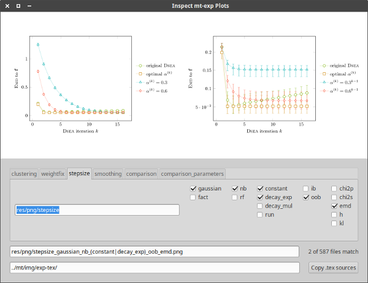

# Experiments on Deconvolution in Cherenkov Astronomy

Obtaining the distribution of a physical quantity is a frequent objective in experimental physics.
In cases where the distribution of the relevant quantity cannot be accessed experimentally,
it has to be reconstructed from distributions of correlated quantities that are measured, instead.
This reconstruction is called *deconvolution*.

This repository contains the experiments conducted for my Master's thesis.
These experiments are centered around the Julia package
[CherenkovDeconvolution.jl](https://github.com/mirkobunse/CherenkovDeconvolution.jl),
which bundles the investigated methods for their application in the field.

## Setup

I recommend to run the experiments in a Docker cluster, where sufficient computational
resources are available.
The results obtained from these experiments can be evaluated locally.

### Local

I strongly recommend to use **Julia 0.6** for the following steps.

To run the experiments locally and to generate the plots, you need to install all module
dependencies on your local system.
You can do so by running the same installation routine you would otherwise use to install
all dependencies in a Docker environment.

    $ cd /path/to/mt-exp                # go to your local clone of repository
    $ julia                             # start the Julia REPL
    julia> include("docker/juliarc.jl") # load the installation routine
    julia> install_dependencies()       # install all dependencies

Restart Julia to complete the installation.

When the installation is complete, you can initialize your Julia kernel by loading the
`juliarc.jl` from the repository's base directory.
Including the `juliarc.jl` imports the modules of this repository, which is mandatory
every time you start Julia.

    julia> include("_init.jl")  # make this call from /path/to/mt-exp

### Docker Container

Most of the experiments require many resources.
They should thus be run in a Docker cluster, where these resources are available.

To do so, a Docker image to be built, from which the Docker containers are derived.
The default `make` target attempts to push the image to an image repository adressed with
the environment variable `DOCKER_REPOSITORY`.

    $ export DOCKER_REPOSITORY="xyz:1234"  # set the repository adress (node name and port)
    $ make image                           # build the Docker image

Once the image is pushed to the repository, you can start the Docker containers from it.
Inside a container, follow the steps described for the local setup.
If your containers have a network file system mounted as the container's home directory,
it suffices to perform this setup once.
Any other container with the same mount point will have Julia's package repository ready,
then.

Inside a container, there is no need to manually include the `_init.jl` file, because this
is done by the global `juliarc.jl` script.

I recommend using at least 4 cores and 8GB of RAM in each experiment.

### SFB 876 Cluster

I provide additional utilities to members of the Collaborative Research Center SFB 876.
These utilities ease the preparation and the usage of the experiments in our Docker cluster.
Please contact me if you are a member being interested in running your experiments there.

However, all experiments can be run in any Docker environment, as described above
(hands-on experience helpful).
Thus, you do not have to have access to the SFB Docker cluster to reproduce the experimental
results. Reach out if you have any issues!

## Usage

### Preparing the Experiments

Each experiment is configured by a YAML file in the `conf/job/` directory.
Some configurations are meta-configurations, from which the actual configurations are generated.
The `Conf` module provides this functionality, generating configurations in `conf/job/gen/`.
However, the generated configurations are already contained in the repository!

    julia> Conf.stepsize()    # generate the configurations of the stepsize experiments
    julia> Conf.comparison()  # ...and those of the experimental comparison

Moreover, the toy data set has to be generated before running any of the experiments.
**This step is mandatory!**

    julia> Data.generate_gaussian()

### Starting the Experiments

Each experiment is implemented as a Julia function from the `Job` module.
Meta-configured functions require the desired configuration file as an argument.

    julia> Job.smearing()                                        # default configuration assumed
    julia> Job.stepsize("conf/job/gen/stepsize_gaussian_nb.yml") # argument required

The following experiments are available:

- `Job.smearing()` tests DSEA on three toy data sets with different amounts of smearing in
  the observable quantities (results presented in Chapter 1).
- `Job.clustering()` is an experiment on the difficulty of classical deconvolution (Chapter 2).
- `Job.weightfix()` evaluates the fixed reweighting proposed in the thesis (Chapter 3).
- `Job.stepsize(file)` evaluates the different step size strategies on different data sets
  and with different classifiers (Chapter 3).
- `Job.comparison(file)` performs a huge set of deconvolutions to find the best method for
  Cherenkov astronomy (Chapter 4).

Random seed initialization ensures that the obtained results are always the same.
Minor changes may occur in case of different package versions.

**Caution: The data sets of MAGIC and FACT, which have been used in the thesis, are not available in public.**
Thus, any experiment that is configured to use one of these data sets
will fail. These experiments are still part of the repository because they document the
experimental setups, at least.

If you run the experiments, make sure to start Julia with multiple worker processes.
You can do so with the `-p` option.

    $ julia -p 4  # use 4 worker processes on which the experiments run in parallel

### Generating the Plots

The plots are generated with the `Res` module.
The first step is to compute the quality metrics displayed in the plots from the deconvolution
results returned by the experiments.
However, the metrics files of all experiments are already contained in the repository!

    julia> Res.all_metrics()                       # generate metrics files from every file in res/spectra/
    julia> Res.metrics("res/spectra/smearing.csv") # be selective, alternatively

The plots are generated from the metrics files, where the function names correspond to the
experiments from the `Job` module.

    julia> Res.smearing()                                       # default assumed
    julia> Res.stepsize("res/metrics/stepsize_gaussian_nb.csv") # argument required

### Inspecting the Results

A huge number of plots is generated, so that the thesis certainly had not enough space for all of them.
Since even keeping an overview became difficult, I wrote a tool for the inspection of plots.
This tool can only render `png` files, but these are easily converted from the `pdf` plots with `make`.
However, all png files are already contained in the repository!

    $ make pngs  # convert each pdf in /res/pdf/ to a png in /res/png/

The inspection tool is started in a dedicated julia session.
It allows you to tick and untick boxes, which correspond to experimental configurations.
This way, multiple configurations can be compared to each other side by side.
The `tex` sources of the selected plots can be copied to another directory (e.g. the git
repository of your next publication) by simply clicking the copy button.

    $ julia inspect.jl  # start a Julia session running the tool

### PDF Metadata

All plots contain PDF metadata identifying the git commit that produced them.
If one of your collegues gave you a plot he doesn't know where it came from, you can read
the PDF metadata with the `exiftool` command line tool (or some similar tool).

    $ sudo apt-get install libimage-exiftool-perl  # install
    $ exiftool SOMEPLOT.pdf                        # inspect

If only the versioning information is relevant to you, use `grep` to produce something less
verbose like:

    $ exiftool SOMEPLOT.pdf | grep Git
    Git Commit                      : fd8be2a762b020b6b4421c97b1ca359dd30c91d8
    Git Origin                      : git@bitbucket.org:mbunse/mt-exp.git
    Git Uncommited Changes          : true

## Contact

Feel free to discuss any issues via the Issues system.

